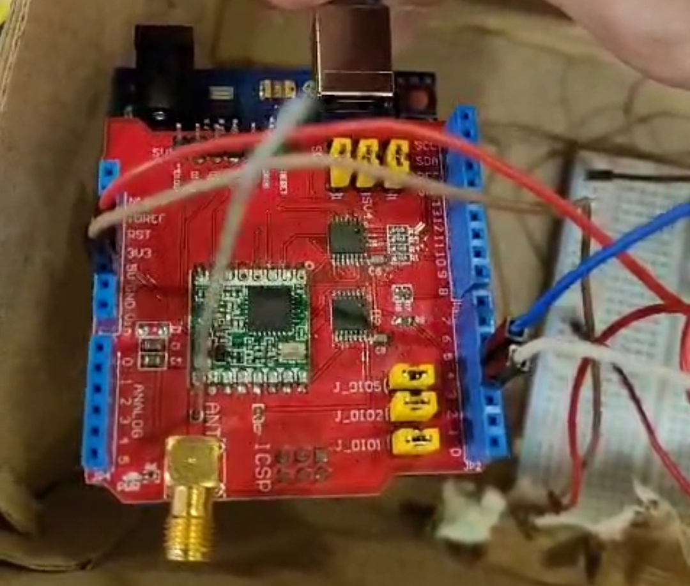
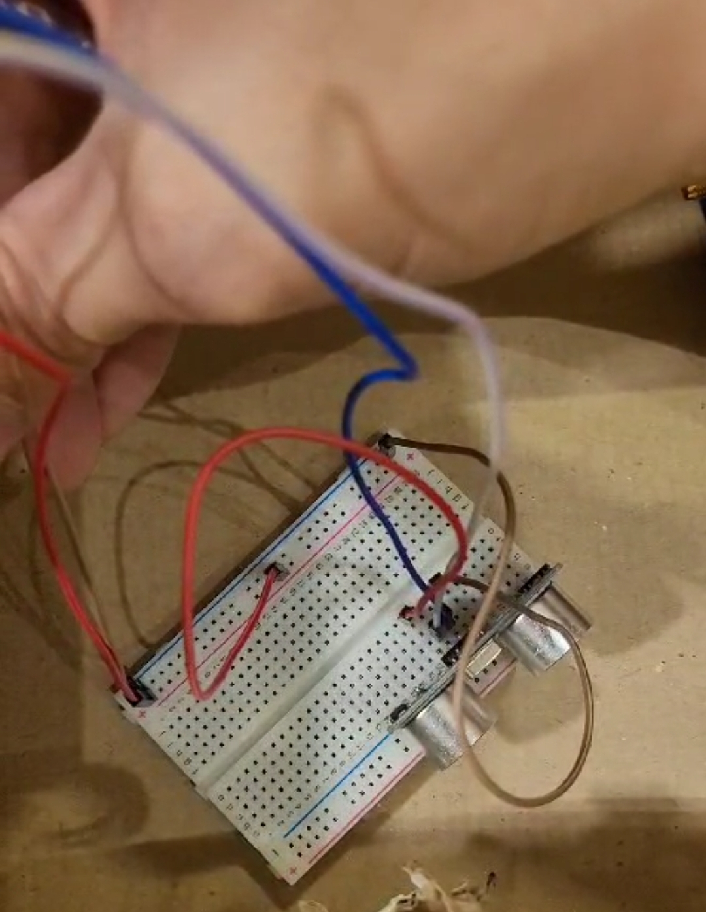
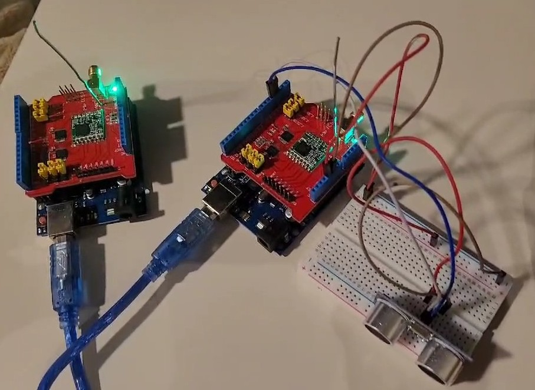

## Fuel Tank Monitoring System

This project is a web application for monitoring fuel levels in tanks, incorporating data received from Arduino sensors through a serial port.

**Key features:**

* **Data collection:** Reads fuel level data from Arduino sensors connected via serial port.
* **Data storage:** Stores data in an SQLite database, including timestamp, fuel level, and tank ID.
* **Web interface:** Provides a user-friendly dashboard for visualizing fuel levels, filtering data by tank and date range, and viewing statistics.
* **Real-time updates:** Utilizes SocketIO for real-time data updates on the web interface.

**Project structure:**

* **`app.py`:** Flask application that handles data processing, database interaction, and web server functionality.
* **`serial_port_reader.py`:** Python script that reads data from the serial port and sends it to the Flask server.
* **`index.html`:** HTML template for the web dashboard.
* **`dashboard.js`:** JavaScript code for handling data visualization, interactions, and SocketIO communication.
* **`style.css`:** CSS stylesheet for the web dashboard.
* **`lora_codes/`:** Folder containing Arduino code for transmitter and receiver using LoRa modules (optional).

* **Getting started:**

1. **Install dependencies:** Install the required libraries by running `pip install -r requirements.txt`.
2. **Configure serial port:** Modify the `arduino = serial.Serial('/dev/ttyACM0', 9600)` line in `serial_port_reader.py` to match your Arduino's serial port and baud rate.
3. **Connect Arduino:** Connect the Arduino sensors to the computer's serial port.
4. **Start the server:** Run `python3 app.py` to start the Flask server.
5. **Access the dashboard:** Open the URL `http://localhost:5000/` in your web browser to access the dashboard.
6. **Send data (optional):**
    * Upload the Arduino code in the `lora_codes` folder to your transmitter and receiver devices.
    * Run `python3 serial_port_reader.py` to start collecting and sending data.

**Arduino Diagram:**

The images above show the diagram for the transmitter arduino. The trigger and echo ports of the ultrassonic sensor are connected to the pin 3 and pin 4 of the arduino, respectively.

The image above show the complete diagram for both arduinos.

## How it works
### Data Gathering
- Arduino with ultrassom sensor. Based on the time interval of response and the speed of sound, a simple calculation is made to know how far from the top of the tank the liquid is
### Protocol
- In order to achieve disponibilty, which is a principle on networking servers, our diagram has an arduino attached with a lora shield that is always available and is connected to a local server (in our case, a laptop).
- But since there will be more than one transmitter, our solution was to have an ID for every transmitter so the server knows which one he's comunicatting.
- For this, transmitters will begin and will only be in handshake state one time. In this state, transmitter will generate a random identifier between 0 and 255 and will send it to the server.
- Server will respond with his final ID, meaning that if he received one that is not available, it will send back another one that is and this will be the transmitter ID for the rest of comunication.
- After handshake state, transmitters can now send fuel data along with his ID, so the server knows where that came from and can Acknowledge it back
- Server will then ACK with the sane ID. When transmitter receives ACK back, it knows that the server received his information and can know work on low power mode
- In lower power mode (sleep state), it will sleep for some period and then wake up to send more data
### Interface
- Shows data and statistics with timestamp for each tank
- Simple, readable and easy to use and navigate
- Warns about low level fuel ( < 15% capacity ) 
## Second Part
**This part is reserved for changes based on teacher suggestions. And those changes are:**
- Server saves energy by working on low power mode on some interval
- Transmitter buffers data that server could't receive

## Protocol for Part Two
- To achieve a behavior of energy saving, some changes were made. After sending its tank fuel level, each transmitter enters in a sleep state. The receiver will also enter in a sleep state if it doesn't receive any message for 5 seconds - that means that all transmitters are asleep - and will remain that way for 1 hour. Upon waking up, it is ready to receive data again and sends a _WAKE_ command, which is received by all transmitters, which will wake up and wait some time based on their ids - to avoid conflicts when sending data - and then will send the current fuel level. The behavior repeats itself, achieving a realiable coordinating and power saving system
- 
## Tests
Manual tests were made to make sure that it would work on a real scenario.
Transmitter and receiver were more than 100 meter distant from one another
**Result** No data loss and was not out of order. The communication had no interferance.

## TODO
This project provides a full framework for monitoring fuel levels in tanks. You can further extend it by adding features like:

* **Alert notifications:** Send email or SMS notifications when fuel levels reach certain thresholds.

* **Historical data analysis:** Implement charting libraries to display historical trends and patterns in fuel level data.
